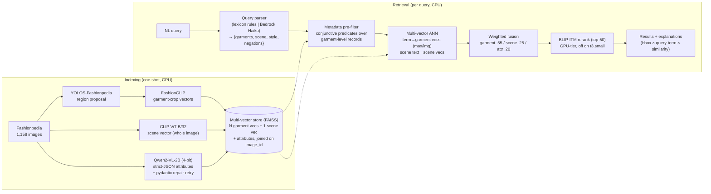

# Multimodal Fashion & Context Retrieval Engine

Natural-language image retrieval over the Fashionpedia dataset that understands
**garment type, color, and environment/context** — and gets compositionality
right: *"a red tie and a white shirt"* will not return a white tie with a red
shirt, because attribute→garment binding is **structural**, not embedding-level.

**Live system**

| | URL |
|---|---|
| Frontend (Amplify) | https://main.d3lql8luqwhsxi.amplifyapp.com |
| API (CloudFront → EC2) | https://d12d9qu7eo4lok.cloudfront.net |
| API docs | https://d12d9qu7eo4lok.cloudfront.net/docs |
| Demo login | `demo@fashionretrieval.dev` / `DemoPass123!` |

Companion docs: [APPROACHES.md](APPROACHES.md) · [CHOSEN_APPROACH.md](CHOSEN_APPROACH.md) ·
[FUTURE_WORK.md](FUTURE_WORK.md) · ablations & latency in [eval/results/](eval/results/)

---

## Architecture



**AWS deployment**: S3 (images + index artifacts) → CloudFront (one distribution:
`/*` → EC2 API over the EIP, `/images/*` → S3 via OAC) · EC2 t3.small (Docker,
systemd, awslogs) · DynamoDB (users, rotating refresh tokens, parse cache) ·
SSM Parameter Store (JWT secret) · ECR + CodeBuild (image builds in-cloud) ·
Amplify (static Next.js) · CloudWatch (EMF metrics dashboard: p50/p95 latency).

## Why this beats vanilla CLIP

CLIP encodes a whole image and a whole sentence into single vectors — a
bag-of-concepts bottleneck. *"Red shirt with blue pants"* and *"blue shirt with
red pants"* land nearly on top of each other. This system fixes that at three
levels:

1. **Region vectors**: garments are detected and embedded individually
   (FashionCLIP on crops), so "tie" similarity is measured on the tie pixels,
   not diluted across the outfit.
2. **Structural binding**: the VLM writes one record per garment
   (`{type, color, color_hex, formality, material}`); the query parser emits one
   predicate per garment mention; the pre-filter requires **each predicate to be
   satisfied by a single garment record on the same image**. "Red tie AND white
   shirt" is a conjunctive join, not a fuzzy vector match.
   `tests/test_compositionality.py` proves the swapped-colors case returns
   different results (and the decoy is excluded outright).
3. **Scene channel**: a separate whole-image CLIP vector carries
   environment/context ("modern office", "park bench"), fused with a
   configurable weight instead of competing with garment signal in one vector.

Soft-fallback: if the hard filter leaves fewer than `min_candidates` images
(imperfect extraction happens), requirements demote to a scoring feature while
negations stay hard — recall degrades gracefully instead of returning nothing.

## Repo structure

```
core/        shared schemas (pydantic), config loader, fashion lexicon
indexer/     Part A — detection/ (YOLOS), models/ (FashionCLIP, SigLIP, CLIP),
             extraction/ (Qwen2-VL | Moondream | Bedrock, JSON repair-retry),
             storage/ (FAISS | OpenSearch | Atlas behind one ABC), pipeline.py
retriever/   Part B — parsing/ (rule | Bedrock + cache), search/ (prefilter,
             multi-vector ANN, fusion), rerank/ (BLIP-ITM)
eval/        metrics, harness, ablation ladder, latency bench, label pooling
api/         FastAPI: JWT auth (rotating refresh), search, explainability,
             admin, rate limits, EMF metrics
frontend/    Next.js (static export): search UI, explainability overlays,
             parse-debug panel, admin dashboard
infra/       Terraform (all resources) + teardown
scripts/     seed_data, run_indexing, sync_artifacts, build_image, deploy_frontend
tests/       pytest — includes the compositionality proof
```

Ground rules kept: ML logic never imports boto3 (AWS adapters live in
`api/`, `scripts/`, and the two explicitly-marked Bedrock modules); every model
choice is a YAML-config backend behind an ABC; storage is swappable
(FAISS default — see tradeoff below).

## Setup

### Local (indexing + eval; GPU recommended)

```bash
python -m venv .venv && . .venv/Scripts/activate   # Windows: .venv\Scripts\activate
pip install torch torchvision --index-url https://download.pytorch.org/whl/cu124
pip install -r requirements.txt

python scripts/seed_data.py                 # download + extract dataset
python scripts/run_indexing.py --limit 50   # prove the pipeline on a subset
pytest                                      # includes compositionality proof
python -m eval.ablations                    # writes eval/results/ablations.md
```

### Deploy (Terraform ≥1.6, AWS credentials configured)

```bash
cd infra && terraform init && terraform plan -out=tfplan && terraform apply tfplan
cd .. && python scripts/seed_data.py --upload        # images → S3
python scripts/sync_artifacts.py push                # index → S3
bash scripts/build_image.sh                          # CodeBuild → ECR (no local Docker)
bash scripts/deploy_frontend.sh                      # build + Amplify deploy
```

CI/CD: `.github/workflows/deploy.yml` — pytest on every push; with repo
secrets set (`AWS_ACCESS_KEY_ID`, `AWS_SECRET_ACCESS_KEY`, `API_URL`,
`AMPLIFY_APP_ID`) it also builds → pushes to ECR → restarts the API via SSM
RunCommand (no SSH anywhere) → redeploys the frontend.

## Vector store choice (and the swap path)

| Option | Cost | Verdict at 1K imgs | At 1M imgs |
|---|---|---|---|
| **FAISS in-process (chosen)** | $0 | ~6K vectors ≈ 12 MB; exact search <1 ms; a managed cluster is overhead with zero payoff | flat scan breaks; migrate |
| OpenSearch `t3.small.search` k-NN | ~$26/mo (free tier only on legacy accounts — not this one) | code-complete impl included | right call: native filtered k-NN |
| MongoDB Atlas M0 vector search | $0 but manual account signup (can't be Terraformed with AWS creds) | code-complete impl included | viable, 512 MB M0 cap hits first |

All three implement the same `VectorStore` ABC; switching is one YAML line
(`storage.backend`). The metadata pre-filter API (`find_images(required,
excluded)`) maps to nested-object queries in OpenSearch/Atlas so structural
binding survives the migration. Scaling math: [eval/results/latency.md](eval/results/latency.md).

## Cost breakdown (monthly, us-east-1)

| Resource | Cost |
|---|---|
| EC2 t3.small (API, 24×7) | **$15.18** |
| Elastic IP (public IPv4) | **$3.65** |
| EBS 30 GB gp3 | $2.40 |
| S3 (~0.3 GB), DynamoDB (on-demand, tiny), SSM, ECR (<0.5 GB), CloudWatch | < $1.50 |
| CloudFront (1 TB free tier), Amplify hosting (~MBs) | ~$0 |
| CodeBuild (~10 min/build) | ~$0.05/build |
| **Total steady-state** | **≈ $23/mo** |
| One-time GPU cost | $0 (indexed on a local RTX 3050; the one-shot `g4dn` path exists but the account's G-quota is 0) |

Stop the bill between demo sessions: `aws ec2 stop-instances --instance-ids
i-0aa8b50bc142eaceb` (EIP keeps the same URL on restart).

## Teardown

```bash
bash scripts/teardown.sh        # empties the bucket + ECR, then terraform destroy
# or: make destroy
```

## Auth model

Access token 15 min (in-memory client-side) · refresh token 7 days, rotating,
httpOnly cookie, SHA-256-hashed jti in DynamoDB with TTL · refresh **reuse
detection revokes the whole token family** (stolen-token defense) · Argon2id
password hashing · role claim (`user`/`admin`) enforced by FastAPI dependencies ·
rate limits on auth and search routes · `iss`/`aud`/`exp` all validated (PyJWT).

## Evaluation

Five acceptance queries (attribute / contextual / complex-semantic /
style-inference / compositional), hand-labeled relevance sets, Recall@{1,5,10},
MRR, nDCG@10, plus the ablation ladder — vanilla CLIP → FashionCLIP whole-image
→ region-based → +attribute filter → +rerank — and the FashionCLIP vs
marqo-fashionSigLIP embedder benchmark. Results: [eval/results/](eval/results/).
Latency: p50/p95 measured at 1K vectors + a math-backed 1M-image projection.
